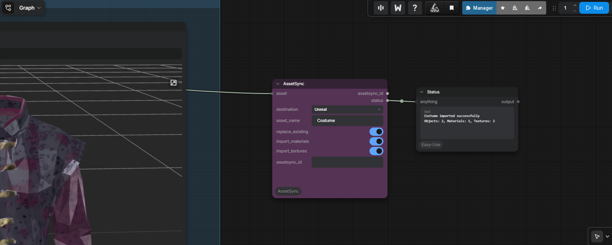

# ComfyUI-AssetSync

ComfyUI-AssetSync bridges AI-generated 3D assets directly from ComfyUI into Blender, Maya, and Unreal Engine.

It does not generate models and contains no generator SDK. Tripo, TRELLIS/TRELLIS2, Hunyuan3D, Meshy, and future generators are examples of upstream tools—not dependencies. AssetSync begins at the final GLB, GLTF, FBX, or OBJ.



```text
Traditional: Generate → Find → Copy → Convert → Browse → Import → Fix → Repeat
AssetSync:   Generate → AssetSync → DCC
```

## What v1 includes

- One generator-agnostic ComfyUI `AssetSync` node
- Persistent identity derived from the ComfyUI node ID, or an explicit `assetsync_id`
- Direct Blender GLB/GLTF/FBX/OBJ import into tracked collections
- Transparent GLB/GLTF → FBX conversion for Maya using headless Blender
- Embedded/external texture extraction and portable Maya `standardSurface` reconstruction
- Direct Unreal Editor GLB/GLTF/FBX import through automated Asset Tools
- Exact-ID replace/reimport in all three destinations
- SHA-256 conversion caching and structured localhost HTTP/JSON responses
- Standard-library-only core; no runtime pip dependencies

## Compatibility

| Source | Blender | Maya | Unreal Editor |
|---|---|---|---|
| GLB | Direct | Automatic FBX conversion | Direct via Interchange |
| GLTF | Direct | Automatic FBX conversion | Direct via Interchange |
| FBX | Direct | Direct | Direct |
| OBJ | Direct | Direct | Not advertised in v1 |

Unreal's GLB/GLTF path requires an Unreal version/project with the Interchange glTF importer enabled. Capability checks intentionally reject combinations not claimed here.

For Maya, glTF's meter units are converted to Maya centimeters and frozen on the imported AssetSync root. This avoids precision-related shading artifacts on thin triangles while leaving native FBX and OBJ scale untouched. FBX smoothing groups are explicitly enabled during the headless Blender export and Maya import.

## Install

### ComfyUI

Clone or copy this repository to:

```text
ComfyUI/custom_nodes/ComfyUI-AssetSync
```

Restart ComfyUI. Connect the final generator output to `AssetSync`. The input accepts a direct file path and common path-bearing dictionaries, lists, tuples, and objects. Select a destination and run the workflow.

`replace_existing` defaults on. The node derives a stable UUID from its ComfyUI workflow node ID, so executing the same node again replaces its synchronized asset. Connect or paste an explicit ID when identity must move between workflows.

### Blender receiver

1. Open **Edit → Preferences → Add-ons**.
2. Choose **Install from Disk** and select `BlenderAssetSync.zip` from this repository.
3. Enable **ComfyUI AssetSync**.

The receiver starts automatically on `127.0.0.1:18951` by default. Its add-on preferences show status, port, automatic-start, and Start/Stop controls.

### Maya receiver

**Blender is required for Maya GLB/GLTF imports.** AssetSync runs Blender headlessly to convert these files to FBX before sending them to Maya. Native FBX and OBJ imports do not require Blender.

1. Double-click `maya_assetsync_setup.bat` and enter the four-digit Maya version.
2. Restart Maya.
3. Open **Windows → Settings/Preferences → Plug-in Manager**.
4. Enable **Loaded** and **Auto load** for `MayaAssetSync_plugin.py`.

The receiver then starts automatically on `127.0.0.1:18952`. The FBX plug-in is loaded automatically when an FBX arrives. Optional controls are available from Maya Python with `from MayaAssetSync.preferences import show_window; show_window()`.

### Unreal receiver

1. Copy the generated `UnrealAssetSync` directory into your Unreal project's `Plugins/` directory.
2. Enable **ComfyUI AssetSync**, **Python Editor Script Plugin**, **Editor Scripting Utilities**, and the Interchange editor/import plugins.
3. Restart Unreal Editor.

`Content/Python/init_unreal.py` starts the receiver automatically on `127.0.0.1:18953`. Assets import under `/Game/AssetSync/Generated/<AssetName>`.

The ready-to-install Blender ZIP and Unreal plugin are rebuilt from shared source with `powershell -ExecutionPolicy Bypass -File .\packaging\build_dcc_packages.ps1`.

## Maya conversion setup

Blender discovery order is:

1. `blender_executable` in config
2. `ASSETSYNC_BLENDER` or `BLENDER_EXECUTABLE`
3. `blender` on `PATH`
4. common Windows, macOS, and Linux locations

Copy [config/assetsync.example.json](config/assetsync.example.json) to `%USERPROFILE%\.assetsync\config.json` on Windows. Set an explicit path if discovery does not find Blender. Converted packages live under `%USERPROFILE%\.assetsync\cache\<asset_id>\maya` by default. Override with `cache_directory` or `ASSETSYNC_CACHE_DIR`.

## Protocol

Receivers expose `GET /v1/status` and `POST /v1/assets`, on localhost only. Import messages have this shape:

```json
{
  "protocol": "assetsync",
  "version": 1,
  "action": "import_asset",
  "asset": {"id": "uuid", "name": "Robot", "mesh_path": "D:/output/robot.glb", "mesh_format": "glb"},
  "destination": {"dcc": "blender"},
  "options": {"replace_existing": true, "import_materials": true, "import_textures": true}
}
```

See [the investigation and design record](docs/investigation.md) for API rationale and primary references.

## Test

Core tests need no DCC installation:

```powershell
python -m unittest discover -s tests -v
```

Manual DCC validation should cover: single mesh/base color, full PBR, multiple meshes/materials, embedded GLB images, nested hierarchy, spaces and Unicode paths, and repeat sync with the same ID. Maya acceptance additionally compares geometry/UVs and verifies reconstructed texture connections after GLB → FBX.

## Security and scope

v1 is same-machine only. Receivers bind to loopback, messages are size-limited, and no remote file transfer is attempted. Do not expose these ports publicly. AssetSync modifies only imported packages carrying its exact ID during replacement.

## License

MIT
